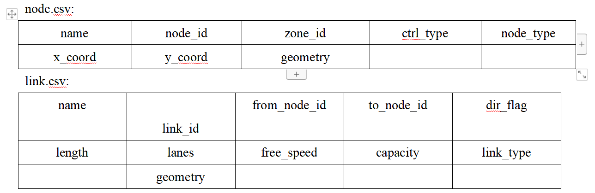
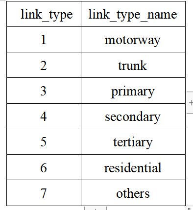
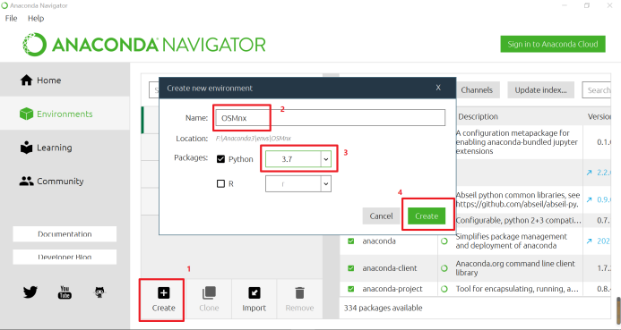
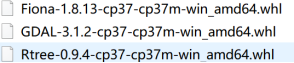
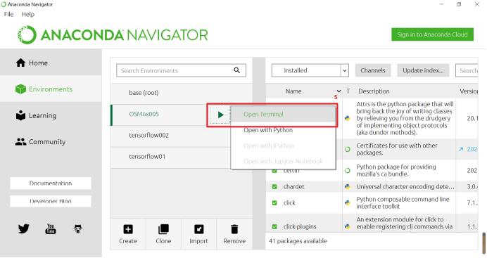
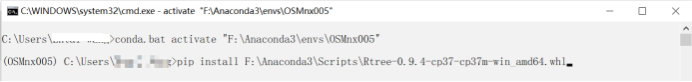
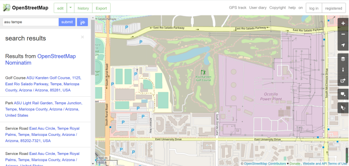
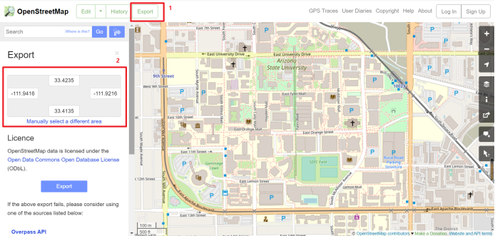
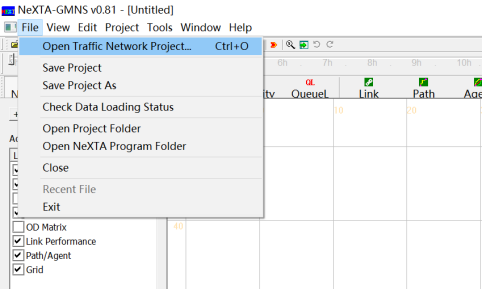
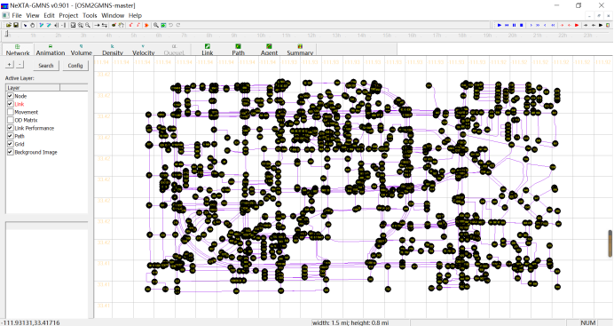

**OSM2GMNS: A tool for generating GMNS standard data file**

**from OpenStreet Map**

**Version 0.9**

OpenStreet Map (OSM) is a free, crowdsourced, worldwide mapping project
and geospatial data repository. This user guide describes a data
conversion tool of OMS2GMNS based on OSMnx, to directly download the OSM
map data and then generate node and link network file in the GMNS
format. For more information, you can visit OpenStreet Map website at
<https://www.openstreetmap.org/>, and check out the latest development
about OSMnx at <https://geoffboeing.com/.>

**1. Understanding GMNS**

GMNS(General Travel Network Format Specification), proposed by the
Zephyr Foundation, which aims to advance the field through flexible and
efficient support, education, guidance, encouragement, and incubation.
Further details can be found at
https://zephyrtransport.org/projects/2-network-standard-and-tools/

A transportation network in GMNS format typically includes node.csv and
link.csv files, as shown in the following table.

**2.How to install OSMnx?**

Further details about OSMnx can be found:
<https://geoffboeing.com/2016/11/osmnx-python-street-networks/>.

Step 1: Set a new virtual environment in Anaconda 3 with Python 3.7

Step 2: Open Terminal in this virtual environment, and install 3
packages namely rtree, gdal, fional in sequence. Input the command line
in terminal: *pip install XXXX.whl*, while the specific versions as
recommended as follows:

Step 3: Install OSMnx, Type a command line: *pip install osmnx*

Step 4: Open the Python IDE such as Pycharm for a typical configuration.

**3.How to use OSM2GMNS?**

We will use the city of Tempe as an example to illustrate how to use
OSM2GMNS tool.

**Step 1: Determining the research boundary of the map**

For example, we want to obtain the map data of Tempe campus of ASU, with
a boundary shown in the map below.

First, please adjust the map to the location of interest:

Second, click on the "export" button:

Then, we can obtain the latitude and longitude coordinate range on the
left side of the window. Please take a note about 4 coordinate values.
In this example, the four values are 33.4135, 33.4235, -111.9216, and
-111.9416, to be used as the input for bbox in the Python code.

**Step 2: Determining the parameters of the *map crawler***

Go to the Python environment and modify the bbox parameter as bbox =
\[33.4135, 33.4235, -111.9216, -111.9416\] in the codes.

Remarks:

\(1\) G = ox.graph_from_bbox(\*bbox, network_type=\'all\'): \'drive\'
means that we only obtain vehicle road, and \'all\' means that we can
obtain all types of roads.

(2) attributes = ox.graph_to_gdfs(G, edges=False): edges=False means
    that no link data will be obtained. Similarly, nodes=False means
    that no node data will be obtained.

**Step 3: Running the OSM2GMNS Python code**

**Step 4: Outputting files**

There are three output files, namely node.csv, link.csv, and demand.csv
from the OSM2GMNS package. The node and link attributes are saved in
node.csv and link.csv respectively, while the O-D demand file is
automatically generated with default values.

**Step 5: Visualization in NEXTA**

You can open the Traffic network project(node.csv) with NEXTA and then
the downloaded map data can be visualized with GMNS format(node.csv,
link.csv).

